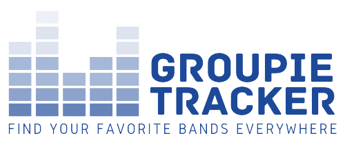

<h1 align="center">Groupie Tracker</h1>

<p align="center">
    
</p>

<h2 align="center">About The Project</h2>
The program enables users to easily stay updated on 52 top bands and provides access to their information, including concert details.
It serves as a convenient tool for music enthusiasts, allowing them to keep track of their favorite artists and never miss out on upcoming concerts.

## Getting Started

Clone the project

```bash
git clonehttps://github.com/amali01/groupie-tracker.git
```

Go to the project directory

```bash
  cd groupie-tracker-geolocalization
```

### Directory Structure

```console
─ Groupie Tracker/
│
├── apiprocess/
│   ├── getallartists.go
│   ├── parseapi.go
│   └── structs.go
│
├── controllers/
│   ├── artistpage.go
│   ├── CssHandlers.go
│   ├── Errors.go
│   └── homepage.go  
│
├── views/
│   ├── css/
│   │   └── ...
│   ├── html/
│   │   └── ...
│   └── images/
│       └── ... 
│
├── main.go
├── go.mod
├── README.md
└── ...
```

## Usage

_make sure you are in project directory_

```bash
go run main.go
```
1. Open http://localhost:8080/ in a browser .
2. Choose your favorite band to see the full details. 

## Additional information
- The project is written in Go.
- Only standard go packages were used.
- It features a user-friendly interface with the following capabilities:

  - **Search Bar:** Find your favorite bands quickly by searching for their name.
  - **Filters:** Sort and filter bands based on various criteria, such as creation date, first album, number of members and locations of concerts.
  - **Geolocation Maps (Using Google API):** Explore the concert locations of your favorite bands on an interactive map.


## Authors

- emahfoodh
- amali01
